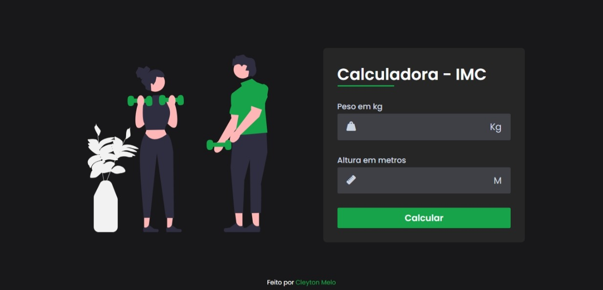

<h1 align="center"> Calculadora IMC </h1>

 

  

## 🚀 Tecnologias

Esse projeto foi desenvolvido com as seguintes tecnologias:

- HTML e CSS
- JavaScript
- Git e Github

## 💻 Projeto

A calculadora IMC (Índice de Massa Corporal) é um padrão internacional de cálculo da obesidade de um indivíduo adotado pela OMS (Organização Mundial da Saúde). 

- [Acesse o projeto finalizado, online](https://F-cleyton.github.io/IMC)